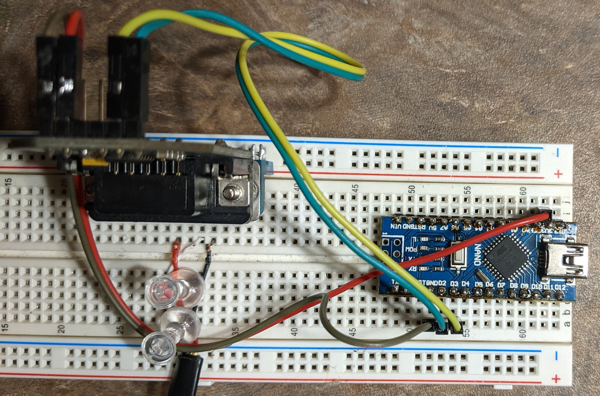

# Arduino Version

This is an example sketch which uses an Arduino nano and can be adapted to an Arduino Uno. Once you get this working and want to have a go at doing more with the data, have a look at [my setup](../My-Current-Setup/) for inspiration!

Please note that there is no MQTT-enabled Arduino version. I would recommend going with other hardware as these boards have no integrated way of communicating the data over the network like the RaspberryPi and ESP modules do.

## Libraries

The libraries this project uses are:

- https://github.com/4-20ma/ModbusMaster
- https://github.com/bblanchon/ArduinoJson

## Hardware

- 1 x Arduino Nano or Arduino Uno
- 1 x RS232 transceiver module. Ex: [MAX3232 Module](https://www.digikey.ca/en/products/detail/mikroelektronika/MIKROE-602/4495610)
- 1 x [6P6C Straight Cable](https://www.digikey.ca/en/products/detail/assmann-wsw-components/AT-S-26-6-6-B-7-R/1972588) (Double check wire colors against [6P6C-Connector.jpg](./6P6C-Connector.jpg))

## Wiring

See the schematic or other photos in this directory for details.

