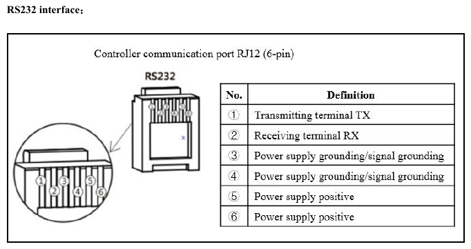

# Arduino Version
This is the version I've worked the most on and is the one I use for my setup. I've included a couple of example arduino sketches and schematics so you can get started easily. I've also included a copy of the setup I currently use, I'll explain it more at the end.

## Setup
Depending on the device you want to use, the connections will be a bit different, a few things will remain the same though. I have created schematics for the Arduino Nano and the ESP8266 examples.

### Libraries
The libraries this project uses are:
- https://github.com/smarmengol/Modbus-Master-Slave-for-Arduino
- https://github.com/nRF24/RF24 (Only for multiple controllers)
- https://github.com/nRF24/RF24Network (Only for multiple controllers)
- https://github.com/knolleary/pubsubclient (Only in my setup)
- https://github.com/arduino-libraries/LiquidCrystal (Only in my setup)

### Charge controller pinout
Here is the pinout of the 6P6C connector on the charge controller as indicated by the modbus manual from SRNE.

### Charge controller cable to MAX3232
Here is how I connect the charge controller to the MAX3232 breakout board. I used a male DB9 connector to plug into the breakout board and to connect it to the brad board, only the top row of contacts are used. My cable's wire colors may not match yours, check out 6P6C.jpg to compare yours against mine. (Note that the wire colors do not match their stereotypical roles. Blame whoever came up with the charge controller pinout)

### MAX3232 Voltage
One thing to note is that the MAX3232 can be powered by 5V or 3.3V, so you might see them used interchangeably in the pictures.

## Arduino Nano

## ESP8266
If you use the ESP8266 make sure you adjust the RX and TX pins for the software serial in the program. According to these pictures, the new values would be `MAX3232_RX = D1` and `MAX3232_TX = D2`.

## Multiple Charge Controllers
You may want to use multiple charge controllers, in which case I would suggest having a look at the multiple charge controllers example. When using multiple charge controllers I would recommend splitting up the roles between the Arduinos and having multiple transmitters and a single receiver.

## My current setup

This is the version I currently use for my solar system.
As such, this version isn't really intended to be immediately plug and play. While the transmitter code will not need to be tweaked very much, the receiver is quite specific to my application.

For my application I use three charge controllers. There are panels on the front of the house (CC1), side (CC2), and back (CC3). Each charge controller has an Arduino nano attached to it and there is an additional arduino for reporting some miscellaneous environment readings and direct amp readings. The Arduinos relay the information back to a receiver node (ESP8266) using RF24 modules. The transmitter then publishes the data over MQTT to a server which hosts it on a web interface. I've also included the PCB I'm using.

