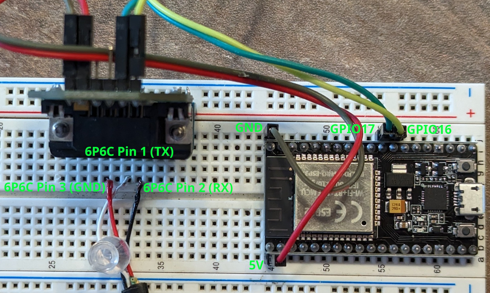

# ESP32 Example

This is an example sketch which connects to a single charge controller so you can get started easily. Once you get this working and want to have a go at doing more with the data, have a look at [my setup](../My-Current-Setup/) for inspiration!

## Libraries

The libraries this project uses are:

- https://github.com/4-20ma/ModbusMaster
- https://github.com/bblanchon/ArduinoJson
- https://github.com/knolleary/pubsubclient (MQTT Example)

## Hardware:

- 1 x ESP32 DevKit Module
- 1 x RS232 transceiver module. Ex: [MAX3232 Module](https://www.digikey.ca/en/products/detail/mikroelektronika/MIKROE-602/4495610)
- 1 x [6P6C Straight Cable](https://www.digikey.ca/en/products/detail/assmann-wsw-components/AT-S-26-6-6-B-7-R/1972588) (Double check wire colors against [6P6C-Connector.jpg](./6P6C-Connector.jpg))

## Wiring:

Additional perspectives in the other pictures in this directory.

## PCB

I designed a PCB which uses an ESP32 and can handle up to 6 charge controllers at once.
Have a look at it [here](../My-Current-Setup/).
