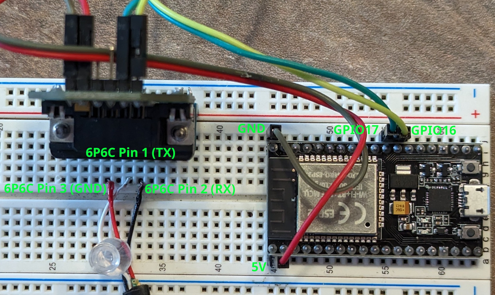

# ESP32 Version
This is the variation I use for my current setup. It was based on the Arduino version, but now it is much simpler to use since it does not need to have one Arduino per controller or use RF24 modules and a receiver module.

I've included an demo sketch so you can get started easily. I've also included a copy of the setup I currently use to showcase a more complicated application, I'll explain it more at the end.

Tested on SRNE ML2440 and ML4860

## Libraries
The libraries this project uses are:
- https://github.com/4-20ma/ModbusMaster
- https://github.com/bblanchon/ArduinoJson

Optional libraries for features that I use in my setup you may also want to use:
- https://github.com/ayushsharma82/AsyncElegantOTA (Optional, Over the air updates)
- https://github.com/ayushsharma82/WebSerial (Optional, Over the air debugging)
- https://github.com/me-no-dev/ESPAsyncWebServer/ (Dependency of OTA and WebSerial)
- https://github.com/me-no-dev/AsyncTCP/ (Dependency of OTA and WebSerial)
- https://github.com/plerup/espsoftwareserial/ (Needed for >2 controllers)
- https://github.com/knolleary/pubsubclient (Needed to publish data over MQTT)
- https://github.com/fdebrabander/Arduino-LiquidCrystal-I2C-library (Only in my setup)

## Demo Setup:
Basic example program and setup, follow this if you just want to get it working before moving onto doing more complicated stuff.

If you want to learn more about the pin-outs, have a look at the schematics and the modbus manual.
Additional perspectives in the other pictures in this directory.

### Hardware:
- 1 x ESP32 DevKit Module
- 1 x RS232 transceiver module. Ex: [MAX3232 Module](https://www.digikey.ca/en/products/detail/mikroelektronika/MIKROE-602/4495610)
- 1 x [6P6C Straight Cable](https://www.digikey.ca/en/products/detail/assmann-wsw-components/AT-S-26-6-6-B-7-R/1972588)

## PCB
Each PCB can handle 1 to 6 charge controllers at once!

### Hardware:
You can find the PCB files and schematics in this directory.

This list is for a fully populated PCB, you may not need everything here, see schematic for details.

NOTE: If you do plan to use my PCB, make sure you verify the footprint of the ESP32 you plan to use. The ones I have are a bit narrower than most, so you may need to adjust the footprint.
- 1 x [ESP32 DevKit Narrow](https://www.amazon.ca/gp/product/B07QCP2451/) (Unless you adjusted the PCB footprint yourself)
- 3 x [MAX3232](https://www.digikey.ca/en/products/detail/analog-devices-inc-maxim-integrated/MAX3232EEPE/1512691) (Or equivalent)
- 3 x [10uF Capacitor](https://www.digikey.ca/en/products/detail/nichicon/ULD2A100MED1TD/7365013)
- 9 x [0.47uF Capacitor](https://www.digikey.ca/en/products/detail/tdk-corporation/FG28X7R1H474KRT06/5803214)
- 3 x [0.1uF Capacitor](https://www.digikey.ca/en/products/detail/vishay-beyschlag-draloric-bc-components/K104K15X7RF5TL2/286538)
- 6 x [1kOhm Resistor](https://www.digikey.ca/en/products/detail/stackpole-electronics-inc/CF14JT1K00/1741314)
- 6 x [6P6C Jack](https://www.digikey.ca/en/products/detail/amphenol-cs-commercial-products/RJE031660110/4889694)
- 6 x [6P6C Straight Cable](https://www.digikey.ca/en/products/detail/assmann-wsw-components/AT-S-26-6-6-B-7-R/1972588)
- 2 x [1000uF Capacitor](https://www.digikey.ca/en/products/detail/rubycon/35ZLH1000MEFC12-5X20/3564067) (Recommended)
- 2 x [19 Position Female Header](https://www.digikey.ca/en/products/detail/sullins-connector-solutions/PPTC191LFBN-RC/810157) (Recommended, for ESP32)
- 3 x [16 Pin Dip Socket](https://www.digikey.ca/en/products/detail/amphenol-cs-fci/DILB16P-223TLF/4292068) (Recommended, for MAX3232)
- 1 x [3 position screw terminal](https://www.digikey.ca/en/products/detail/phoenix-contact/1984620/950850) (Optional)

## My Current Setup
This is the version of the program I currently use in my system.

As such, this version isn't really intended to be immediately plug and play.
Like with the Arduino version, I have a MQTT broker running on a server. The ESP32 sends the charge controller data to the server as JSON, where the MQTT topic indicates which charge controller it is.
The only hardware difference between my setup and the examples is that in my setup I also have an ESP8266 with an LCD attached which subscribes to the MQTT feed to display some power data in a convenient location around the house.

I use three charge controllers. There are panels on the front of the house (CC1), side (CC2), and back (CC3). Each charge controller connects to it's corresponding connector on the PCB (there are labels you can't see clearly in the picture) and the ESP32 cycles through them one a a time, fetching data and publishing it as JSON to a MQTT broker which then hosts it on a web interface.

CC1 and CC2 are ML4860 charge controllers, CC3 is a ML2440.

(I skipped to version v2,1 because my v2.0 boards accidentally used ADC2 pins for some serial ports and ADC2 is needed for the WiFi, so the WiFi signal was extremely weak. Had to re-design and order new boards.)