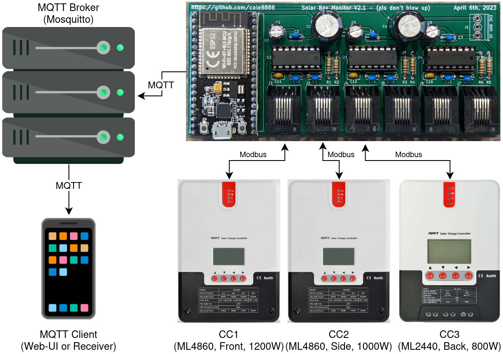
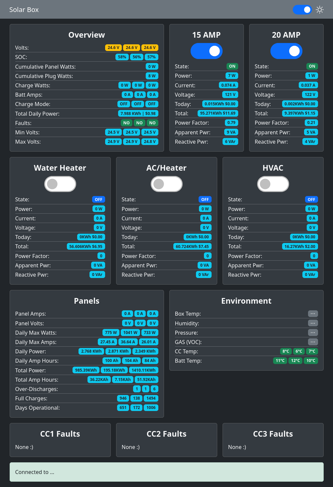

# My-Current-Setup

This is the setup I currently use. Feel free to use it for inspiration!

This version isn't intended to be plug and play like the other examples as it is specific to my needs.

## Layout

I have 3 solar charge controllers, one for the front, side, and back arrays. They feed into the ESP32 which collects the data and publishes it to an MQTT server that clients (such as the web-ui) can connect to.

I also have an ESP8266 with an LCD attached that subscribes to the MQTT feed to display some data in a convenient location around the house.

## Libraries

The libraries this project uses are:

- https://github.com/4-20ma/ModbusMaster
- https://github.com/bblanchon/ArduinoJson
- https://github.com/knolleary/pubsubclient
- https://github.com/plerup/espsoftwareserial/ (Optional, needed for >2 controllers)
- https://github.com/ayushsharma82/AsyncElegantOTA (Optional, Over the air updates)
- https://github.com/ayushsharma82/WebSerial (Optional, Over the air debugging)
- https://github.com/me-no-dev/ESPAsyncWebServer/ (Dependency of OTA and WebSerial)
- https://github.com/me-no-dev/AsyncTCP/ (Dependency of OTA and WebSerial)
- https://github.com/fdebrabander/Arduino-LiquidCrystal-I2C-library (Optional, for receiver)

## Hardware

### PCB

I designed a custom PCB for this, have a look at the [PCB files and schematic](./PCB%20and%20Schematic/).

Each PCB can handle up to 6 charge controllers at once!

NOTE: If you do plan to use my PCB, make sure you verify the footprint of the ESP32 you plan to use. The ones I have are a bit narrower than most, so you may need to adjust the footprint.

### Components:

This list is for a fully populated PCB, you may not need everything here, see schematic for details.

- 1 x [ESP32 DevKit Narrow](https://www.amazon.ca/gp/product/B07QCP2451/) (Unless you adjusted the PCB footprint yourself)
- 3 x [MAX3232](https://www.digikey.ca/en/products/detail/analog-devices-inc-maxim-integrated/MAX3232EEPE/1512691) (Or equivalent)
- 3 x [10uF Capacitor](https://www.digikey.ca/en/products/detail/nichicon/ULD2A100MED1TD/7365013)
- 9 x [0.47uF Capacitor](https://www.digikey.ca/en/products/detail/tdk-corporation/FG28X7R1H474KRT06/5803214)
- 3 x [0.1uF Capacitor](https://www.digikey.ca/en/products/detail/vishay-beyschlag-draloric-bc-components/K104K15X7RF5TL2/286538)
- 6 x [1kOhm Resistor](https://www.digikey.ca/en/products/detail/stackpole-electronics-inc/CF14JT1K00/1741314)
- 6 x [6P6C Jack](https://www.digikey.ca/en/products/detail/amphenol-cs-commercial-products/RJE031660110/4889694)
- 6 x [6P6C Straight Cable](https://www.digikey.ca/en/products/detail/assmann-wsw-components/AT-S-26-6-6-B-7-R/1972588)
- 2 x [1000uF Capacitor](https://www.digikey.ca/en/products/detail/rubycon/35ZLH1000MEFC12-5X20/3564067) (Recommended)
- 2 x [19 Position Female Header](https://www.digikey.ca/en/products/detail/sullins-connector-solutions/PPTC191LFBN-RC/810157) (Recommended, for ESP32)
- 3 x [16 Pin Dip Socket](https://www.digikey.ca/en/products/detail/amphenol-cs-fci/DILB16P-223TLF/4292068) (Recommended, for MAX3232)
- 1 x [3 position screw terminal](https://www.digikey.ca/en/products/detail/phoenix-contact/1984620/950850) (Optional)

## Web Interface

This is a customized version of the [example web interface](../Web-Interface-Example/). It has a different layout since I needed to display data from 3 charge controllers while also having smart plug controls.

- The Web interface was originally based on https://github.com/fabaff/mqtt-panel
- Server icon in diagram is from [Roundicons](https://www.flaticon.com/free-icons/server).
