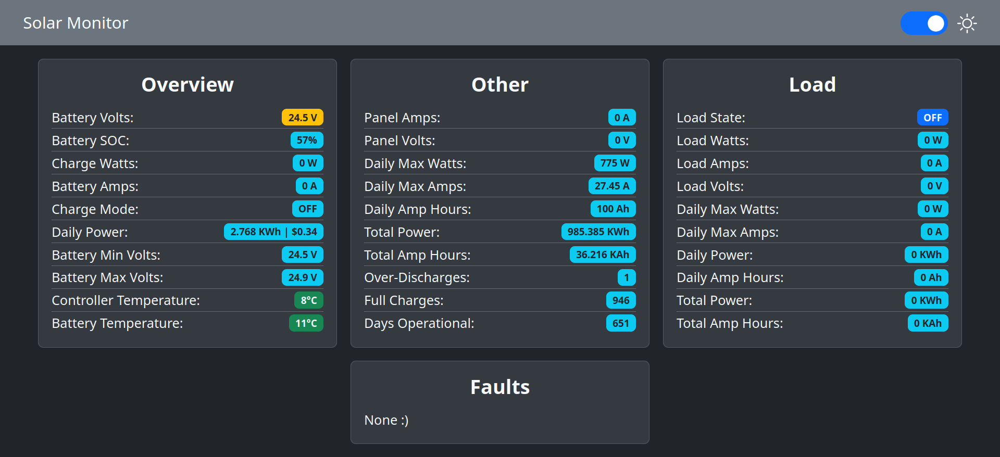

# SRNE-Solar-Charge-Controller-Monitor

Read data from SRNE solar charge controllers via modbus over RS232.

This repository contains several example programs for reading data from SRNE solar charge controllers using Raspberry Pi, ESP32, ESP8266 and Arduino Nano / Uno.

Based on the modbus manuals, this should also work with some Renogy controllers, but I do not have one on hand to test with.

## Example Setups:

Here are some example programs to get started. If you follow the setup instructions in the readme files of each directory you should be able to talk to your controller. If you are just getting started, don't use the MQTT ones.

### [Raspberry Pi](./RaspberryPi-Examples/)

### [ESP32](./ESP32-Examples/)

### [ESP8266](./ESP8266-Examples/)

### [Arduino Nano / Uno](./Arduino-Examples/)

## Web-Interface and MQTT

I've included an [example web interface](./Web-Interface-Example/) you can use in combination with the MQTT-enabled example programs. To use it, you will need to setup an MQTT broker such as [Mosquitto](https://github.com/eclipse/mosquitto) or use a cloud broker. You will also need to set all the appropriate settings in the chosen program and the [index.js](./Web-Interface-Example/index.js) file.

I also included my custom web interface which I am using for my setup. It has the ability to read data from and control smart plugs flashed with Tasmota. Have a look at it [here](./My-Current-Setup/Web-Interface/).

## My Current Setup:

The setup I use is a customized version of the ESP32 Example, I also designed a custom PCB. Have a look at [My-Current-Setup](./My-Current-Setup) if you want some inspiration for your own setup!

## Troubleshooting:

If you notice lots of timeouts, or other errors, try some these steps before creating an issue:

- Try a different power supply and USB cable. My ML2440 does not respond when I use one of my USB power bricks, but it does with another.
- Try increasing the modbus timeout value.
- Try using a shorter cables and moving them away from interference.
- Verify you are using straight cables and not ones that reverse from one end to the other.
- Try using HardwareSerial instead of SoftwareSerial. I've found HardwareSerial is more reliable, configure the program to use it if you are having problems.

<b>If these don't help or if you need clarification, feel free to create an issue and I'll see what I can do!</b>

## Other notes:

- I've included the SRNE modbus manual if you want to have a look at it. My examples read all the registers I think are important, but there are lots of other registers which I haven't touched. Be careful, some of them can be written to!

- The Python version was originally based on: http://vcsco.com/uncategorized/renogy-rover-monitoring-with-the-raspberry-pi/

- The Web-Interface was originally based on: https://github.com/fabaff/mqtt-panel
