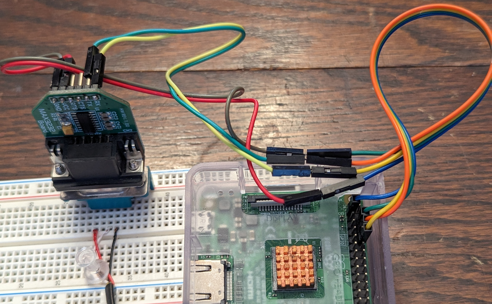

# Raspberry Pi Version
This example fetches the data from the controller and prints it to the console. You have the option to print it out in a text or json format.

If you encounter any issues, create an issue and I'll try to help.

## Setup:
You will need to enable serial on the raspberry pi, I used this guide: https://pimylifeup.com/raspberry-pi-serial/

## Libraries
- [pymodbus](https://github.com/pymodbus-dev/pymodbus)
- [paho-mqtt](https://pypi.org/project/paho-mqtt/) (Only for MQTT version)

## Hardware:
- 1 x Raspberry Pi
- 1 x RS232 transceiver module. Ex: [MAX3232 Module](https://www.digikey.ca/en/products/detail/mikroelektronika/MIKROE-602/4495610)
- 1 x [6P6C (RJ12) Straight Cable](https://www.digikey.ca/en/products/detail/assmann-wsw-components/AT-S-26-6-6-B-7-R/1972588) (Double check wire colors against [6P6C-Connector.jpg](../6P6C-Connector.jpg))

You may also need to switch the serial device depending on what Pi or other device you are using.

## Wiring
See other pictures for different perspectives.

