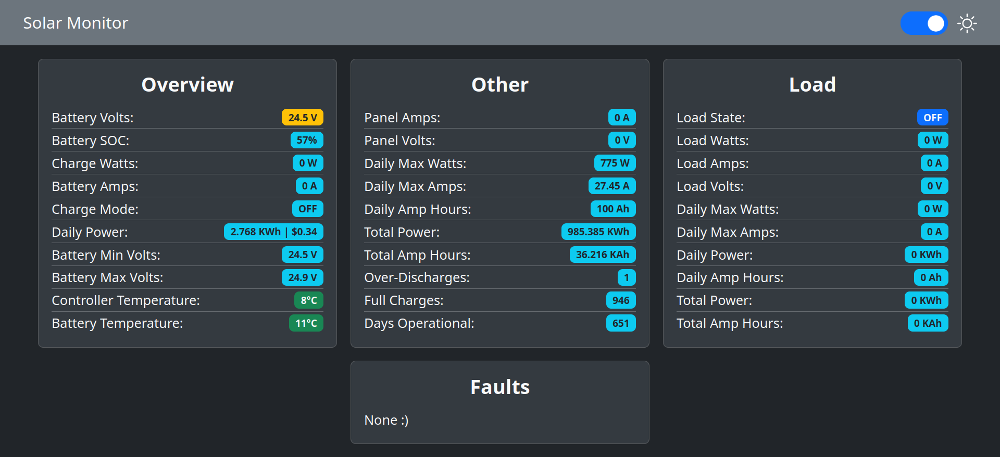

# Web Interface Example

This is an example web interface for viewing data returned by the example programs which publish to MQTT.

Since each of the MQTT-enabled example programs publish the data using the same JSON format, they should work out of the box assuming you specify the MQTT broker settings.

To use the interface you will need to open [index.js](./index.js) and specify the address and port of your MQTT broker along with any credentials.

This uses websockets to get the MQTT data to the browser. When configuring your broker you may need to set those up and have them run on a different port than the rest of the MQTT traffic.

Originally based on https://github.com/fabaff/mqtt-panel
